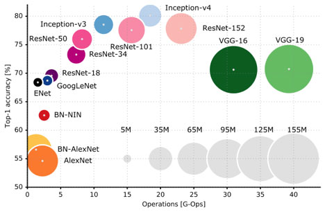

## Notes from `Intro to Deep Learning with Tensorflow`

### General
 This note only keeps high level ideas. For detailed note regarding implementations, check out Practice [repo](https://github.com/ZhenguoChen/Intro2Tensorflow4DeepLearning) with notes

### Convolution Neural Network notes
* convolution [filters](https://www.saama.com/different-kinds-convolutional-filters/)
* Deconvolution (transpose convolution, used in image segmentation) [video](https://www.youtube.com/watch?v=nDPWywWRIRo) **TODO**
* To prevent overfitting: Data Augmentation, Dropout
* To train CNN more efficient or reduce number of parameters: dilated convolution, separable convolution, Xception CNN
* visualize convolution results and heatmap in [post](https://towardsdatascience.com/understanding-your-convolution-network-with-visualizations-a4883441533b)

### existing models
* 
* model studied: **TODO**
    * VGG-16

### Class Activation Map:
* [paper](http://cnnlocalization.csail.mit.edu/) **TODO**
* [post](https://towardsdatascience.com/visual-interpretability-for-convolutional-neural-networks-2453856210ce)
* Code from [repo](https://github.com/anktplwl91/visualizing_convnets/blob/master/model_training_and_visualizations.py):
    ```
    model = InceptionV3(weights='imagenet')
    img_path = 'any test image'

    img = image.load_img(img_path, target_size=(IMG_SIZE[0], IMG_SIZE[1]))
    x = image.img_to_array(img)
    x = np.expand_dims(x, axis=0)
    x = preprocess_input(x)

    preds = model.predict(x)
    print ("Predicted: ", decode_predictions(preds, top=3)[0])

    #985 is the class index for class 'Daisy' in Imagenet dataset on which my model is pre-trained
    flower_output = model.output[:, 985]
    last_conv_layer = model.get_layer('mixed10')

    grads = K.gradients(flower_output, last_conv_layer.output)[0]
    pooled_grads = K.mean(grads, axis=(0, 1, 2))
    iterate = K.function([model.input], [pooled_grads, last_conv_layer.output[0]])
    pooled_grads_value, conv_layer_output_value = iterate([x])

    #2048 is the number of filters/channels in 'mixed10' layer
    for i in range(2048):
        conv_layer_output_value[:, :, i] *= pooled_grads_value[i]

    heatmap = np.mean(conv_layer_output_value, axis=-1)
    heatmap = np.maximum(heatmap, 0)
    heatmap /= np.max(heatmap)
    plt.savefig(heatmap)

    #Using cv2 to superimpose the heatmap on original image to clearly illustrate activated portion of image
    img = cv2.imread(img_path)
    heatmap = cv2.resize(heatmap, (img.shape[1], img.shape[0]))
    heatmap = np.uint8(255 * heatmap)
    heatmap = cv2.applyColorMap(heatmap, cv2.COLORMAP_JET)
    superimposed_img = heatmap * 0.4 + img
    cv2.imwrite('image_name.jpg', superimposed_img)
    ```

### RNN

* LSTM has two states output:
    ```
    Basic units of LSTM networks are LSTM layers that have multiple LSTM cells.

    Cells do have internal cell state, often abbreviated as "c", and cells output is what is called a "hidden state", abbreviated as "h".

    Regular RNNs do have just the hidden state and no cell state. It turns out that RNNs have difficulty of accessing information from a long time ago.

    For instance, check these two long sentences:

    Cows, that eat green green ... green grass are OK.

    Cow, that eat green green ... green grass is OK.

    It would be very hard for RNN to learn the singular/plural dependency, but LSTM are capable of doing that.
    ```
* Machine Translation with Attention [tutorial](https://www.tensorflow.org/tutorials/text/nmt_with_attention)

### Batch Normalization helps converge (TODO)